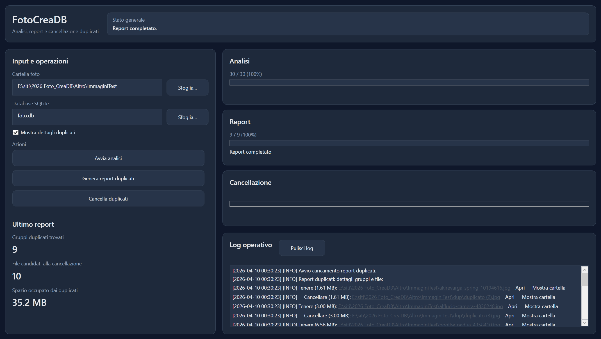

# FotoCreaDB

App desktop WPF per analizzare collezioni di foto, generare report sui duplicati e cancellare immagini duplicate usando un database SQLite.

## Caratteristiche

- Analisi completa di una cartella di foto
- Individuazione e raggruppamento dei duplicati
- Generazione di report con riepilogo e dettagli
- Cancellazione sicura dei file duplicati
- Interfaccia moderna WPF (dark theme)

## Requisiti

- Windows 10/11
- .NET 8 SDK
- Visual Studio 2022 (consigliato) o sistema CLI con supporto per progetti WPF su .NET 8

## Installazione

1. Clona il repository:

   git clone https://github.com/archistico/Foto_CreaDB.git
   cd Foto_CreaDB

2. Apri la soluzione in Visual Studio 2022:
- File > Open > Project/Solution > seleziona la soluzione del repository
- Imposta `FotoCreaDB.Wpf` come progetto di avvio
- Ripristina i pacchetti NuGet se necessario
- Build e Run (F5)

3. (Alternativa CLI) Dal terminale con .NET 8 SDK installato:

   dotnet restore
   dotnet build
   dotnet run --project FotoCreaDB.Wpf

## Uso

- Specifica la cartella contenente le foto nel campo "Cartella foto".
- Specifica il file database SQLite (verrà creato se non esiste).
- Premi "Avvia analisi" per eseguire la scansione.
- Usa "Genera report duplicati" per esportare i risultati.
- Usa "Cancella duplicati" per rimuovere i file selezionati (verifica sempre il report prima di cancellare).

## Configurazione e file

- `FotoCreaDB.Wpf` contiene l'interfaccia e le risorse XAML.
- Il database usato è SQLite (file locale). Assicurati di avere permessi di scrittura nella cartella scelta.

## Troubleshooting

- Se l'app non si avvia, controlla gli errori di build in Visual Studio e assicurati che .NET 8 SDK sia installato.
- Per problemi con permessi su file/directory, avvia Visual Studio come amministratore o scegli directory con permessi adeguati.

## Contribuire

1. Fork del repository
2. Crea un branch feature: `git checkout -b feature/nome-feature`
3. Commit e push delle modifiche
4. Apri una Pull Request descrivendo le modifiche

Segui le convenzioni del progetto e aggiungi test quando possibile.

## Licenza

Questo progetto è distribuito sotto licenza MIT. Vedi il file `LICENSE` per i dettagli.

## Contatti

Per segnalare problemi o richieste, apri un Issue sul repository GitHub.